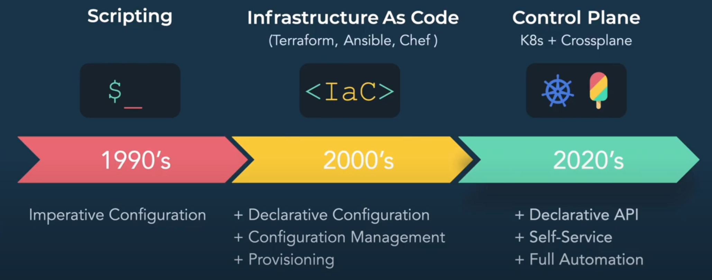

# Utilizing Kubernetes as an universal control plane

Control planes are said to be the next big thing in infrastructure managing. 

- Kubernetes' control planes are great for handling its internal state - but what prevents it from handling external states as well?
- Can we build/declare our complete tech stack inside Kubernetes in order to streamline and simplify our codebase?
- Why bother with control planes when tools like terraform work?
- Is control planes a better abstraction from a software developer standpoint or does it just introduce new issues?
- Can everything be managed by a control planes - or is some things fundamentally incompatible with this paradigm? 

## Topics covered
- Cloud-Native
- Infrastructure as Code
- GitOps
    - Bootstrapping problem
- Why control planes?
- Declarative configuration vs. declarative APIs
- Terraform vs. Crossplane
- Controlling external resources from inside Kubernetes
- The platform team is now a cloud provider for the developers.
- Using Terraform and Crossplane together 
- Scalability
- Infrastructure streamlining 

## Notes
- What is the difference between crossplane and just building your own operator? I can't tell what you will gain from using crossplane vs. just building your own controller/operator.

## Sources
- https://blog.upbound.io/outgrowing-terraform-and-migrating-to-crossplane/
- https://www.libhunt.com/compare-terraform-vs-crossplane
- https://www.eficode.com/blog/outgrowing-terraform-and-adopting-control-planes
- https://blog.crossplane.io/crossplane-vs-terraform/
- https://youtu.be/UffM5Gr1m-0
- https://www.youtube.com/watch?v=UffM5Gr1m-0&ab_channel=Crossplane

## Alternatives:
- Terraform
    - https://www.runatlantis.io/